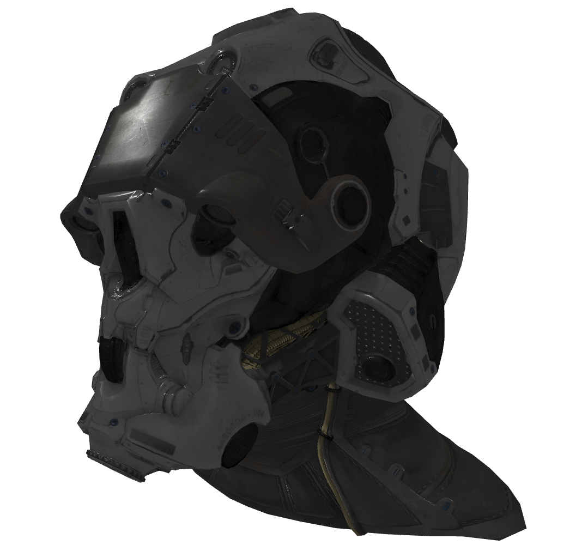

# ARES

## Overview

**ARES** is an acronym for <b>A</b>nother <b>R</b>endering <b>E</b>ngine <b>S</b>oftware. It is a simple 3D graphics engine based on OpenGL ES 2.0, mostly meant as a learning tool to explore 3D technologies and rendering techniques. A lot of content from [learnopengl.com](https://learnopengl.com/) has been used as a reference.

This library specifically targets embedded systems and it is meant to be portable and use as little dependencies as possible. It is written in C++11 with as much use of the STL as possible.

The source code is documented using doxygen, you can build the doxygen documentation from the docs/doxygen folder.

Please note that this project is at a very early stage, so very little and basic features are supported.

## Building

The libraries and test executables can be built using cmake.

```
mkdir build ; cd build
cmake ..
make
./gltf_test
```

Below a sample image showing the expected output of the gltf_test application.



## Modules

The ARES library is made of the following libraries:

- libares.so - This is the core ARES library, containing the actual rendering engine to define 3D objects such as renderers, scenes, nodes, meshes, materials and the OpenGL utility and abstraction functions for textures, buffer objects, shaders, etc.
- libgltf.so - This is an optional module to load gltf files and create ARES objects for the scenes. This module uses tinygltf (see third-party section below), only basic gltf features are currently supported. This module is optional, you don't need to link it in your executable if you don't plan to load gltf files
- libport.so - This is the driver layer that is responsible for creating the render surface using the underlying window system/graphics driver. In the current version, only a X11 port has been created and tested

## Dependencies

ARES has the following dependencies:

- libpng
- libGLESv2
- libEGL
- libX11 (for the sample X11 port)

## Third-party

ARES uses the following third-party modules:

- [tinygltf](https://github.com/syoyo/tinygltf)
- [glTF-Sample-Models](https://github.com/KhronosGroup/glTF-Sample-Models) - this is for the sample models to load and render gltf files

## Environment

ARES has been developed and tested on the following environment:

- amd64 architecture
- Debian 10 OS
- libpng version 16.36.0
- libGLESv2 version 2
- libEGL version 1
- libX11 version 6.3.0

## License

This software is distributed under the MIT License.
